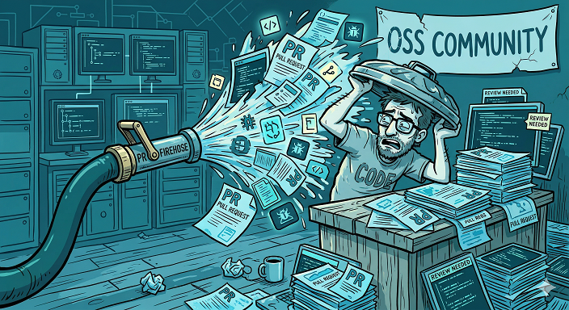
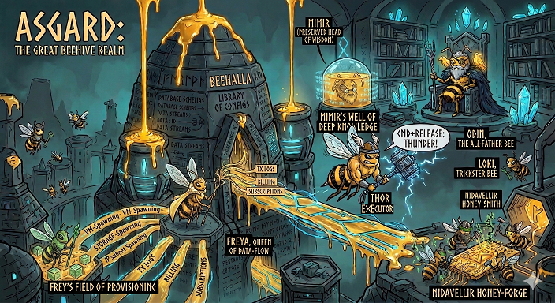

In my [last post](2026-02-25-oss-communities-and-ai.md) I mentioned wanting to integrate AI into open source carefully — without pushing it on anyone, without letting it go wild in our repos, and without making the experience worse for contributors who are just trying to learn and ship code. A month later, I have something to show.

## What I Built (and Why)

[Guardian Driven Development](https://siliconsaga.github.io/yggdrasil/gdd/) is a methodology for human-AI collaboration. It wraps existing dev practices — BDD, TDD, code review, etc — in a layer of structured guidance that adapts to who you are, what you're doing, and how much time you have. It also adds utility and AI tooling to help make agentic development safer and more transparent.

But that's the technical pitch, and it misses the point.

The real reason I built GDD is that I'm concerned about people.

## The Junior Engineer Problem

We're in the early days of what I think will be a genuine social shift. AI agents are getting remarkably capable at writing code (among other things), and the world's response has been... complicated (prior blog covers that some). Tools like [Gas Town](https://gastownhall.ai/) amazingly let a single person orchestrate whole teams of agents. That's impressive, and I love both these efforts and how they enable individuals to build really cool things. I especially am thrilled to see people simply have fun doing things they couldn't do before - even if they only do it for themselves rather than try to become the first [solopreneur unicorn](https://www.fastcompany.com/91447642/how-close-is-the-first-solopreneur-unicorn).

But it optimizes for throughput. The AI is an amplifier — you point it at a problem, it churns. What it doesn't necessarily do is help anyone *learn* or work better together. The [Wasteland](https://steve-yegge.medium.com/welcome-to-the-wasteland-a-thousand-gas-towns-a5eb9bc8dc1f) aims to link Gas Towns together, but again somewhat primarily to align a thousand individual fire hoses in desired direction(s).

Meanwhile, the [traditional path for junior engineers is evaporating](https://stackoverflow.blog/2025/12/26/ai-vs-gen-z/). Code review from senior devs? They're busy prompting agents, and there's so much more to review now anyway. Pair programming? Why pair with a human when the AI is faster? Mentorship? But all you need is to [ask Claude to do it, right](https://dev.to/the_nortern_dev/the-junior-developer-is-extinct-and-we-are-creating-a-disaster-3jh2)? Why ever hire juniors?

I've watched this happen in open source too. Terasology has been a learning ground for hundreds of contributors over the years — many of them [students](https://summerofcode.withgoogle.com/archive/2019/organizations/5741667284418560), hobbyists, first-time coders. The thing that made it work wasn't the code; it was the community of people willing to explain, guide, and be patient. AI shouldn't replace that. It should *augment* that. So far it has mostly been well-intentioned but misplaced PR firehosing, especially for popular projects.

## What GDD Actually Does

Wrapped in the overall [Yggdrasil "meta-workspace"](https://github.com/SiliconSaga/yggdrasil) it provides a framework around the development process that makes it easier to use AI agents in a way that stays personal, and helps you focus on what you want at a given point. It helps you help others within a community, by adopting and improving practices unique to that setting and to figure out how you want to work as a contributor. It encourages doing so safely and meaningfully, trying to inspire flow and learning - not just churning out code or even unreviewable slop. And as you get used to working with your agent over time the process becomes increasingly personalized to you, yet produces sharable tidbits.

So GDD has:

- **Modes** that adapt ceremony to your situation. Got 15 minutes on your phone with a remote Claude workspace? Quick mode. Saturday deep dive? Zen or Flow mode. First time touching BDD? Mentoring mode — where the AI explains its reasoning, teaches practices in context, and walks you through the tools rather than just generating code at you.

- A **Thalamus file** — named after the brain's relay station that processes and routes input rather than storing it. It's a shared markdown file where you and the AI capture observations, concerns, and half-formed ideas between prompts and sessions. Not committed to git, not AI-private. A thinking space you both co-author that gets processed through housekeeping and routed to permanent homes. It turns out this creates a surprisingly natural async collaboration rhythm.

- **Trust and safety** that tries to carefully inspect AI instructions in new components, both for itself and its driver, logging concerns *before* processing potentially sketchy content so there's a breadcrumb even if something goes wrong. It also watches your back — if a typo or ambiguous instruction could cause damage, or a PR might get sent to the wrong branch, it should pause to check rather than blindly executing.

- **Community-aware collaboration** — when a project has contributor guidelines, the AI should adapt to that community's way of working: their conventions, their review expectations, their definition of a good PR. If no guidelines exist, GDD's own practices fill the gap. Either way, the agent should aim to contribute faithfully with its human driver, not flooding repos with AI noise.

- A **self-improving loop** where the framework literally gets better through use. Observations become skills. Friction becomes automation. The capture heuristics themselves get tuned. Like retrospectives, but for a partnership where one side's memory regularly experiences amnesia. Or in some cases pretty much both ;-)

- **Scaffolding, not embedding.** GDD wraps your projects without requiring them to adopt anything. No AGENTS.md, no AI config files, no agentic cruft in your repo. The workspace provides the methodology; your projects stay clean. You can use GDD to contribute to any project — even one that hasn't heard of it.

## The Part I Can't Put in Docs

The [Yggdrasil documentation site](https://siliconsaga.github.io/yggdrasil/) tries to covers all this, although of course it is a work in progress. What it can't convey is the *feel*.

In my first real GDD session, I spent hours brainstorming, implementing, iterating on reviewer feedback across two PRs, running a first-ever housekeeping audit — and at one point I was writing stray thoughts in the Thalamus while the agent worked on something else, then I wandered off. The agent noticed the update. It responded. When I came back, there was a thoughtful reply and an option to integrate it into the next step.

That felt like collaboration, not automation. Like a mildly quirky colleague who happens to have supernatural abilities and infinite patience. Occasionally humans can enter a flow state from intense activity, maybe with tools. It was a surprise to enter a flow state _with_ my tools.

On a second workstation, a parallel agent session improved a code review tool — and at one point with my encouragement used that to resolve stale comments on a PR from the first session, which was still going. Two workspaces, two agent sessions, intersecting on real work. It felt like something new.

I've put [session transcripts](https://siliconsaga.github.io/yggdrasil/gdd/samples/) on the docs site, but honestly — they don't do it justice. The magic is in the flow. The best way to understand it is to try it.

## Who This is For

I built GDD for open source communities like [Terasology](https://terasology.org/), where contributors have ranged from experienced maintainers to students writing their first PR, even those excited for the field yet who lived a very different life. But I don't think it stops there.

- **Starting developers** who need mentorship that scales — an AI that teaches, not just generates, and that can integrate you with a community rather than alienate
- **Experienced engineers** who want to work with AI without surrendering judgment or agency, or losing the personal touch with the creative process
- **OSS maintainers** who want to safely integrate AI without overwhelming their community or pushing away contributors
- **Parents and busy humans** who have fragmented time and need a workflow that adapts — the original "Dad-Driven Development" use case, which is only half a joke
- **Civic projects** like Demicracy where technology should serve democratic participation, not just efficiency (more on that later!)

## The Honest State of Things

GDD is an MVP, and the rest of the Yggdrasil workspace still contains piles of my in-progress nerd stuff that needs tidying. There are gaps. The mentoring mode hasn't been deeply exercised. The BDD skill is a stub. The "bring GDD to your own project" story requires cloning my entire messy workspace. Several skills have contradictory instructions that need cleanup.

But it exists, it can be used, and it works well enough that I built two full features with it in a single weekend, across two machines, while my kids were around or one even on my lap while agent-driving.

More importantly, it's designed to improve through its own use — each session makes the framework a little better. That feels right for something that's supposed to help people grow.

## Try It

If any of this resonates:

1. [Clone the workspace](https://siliconsaga.github.io/yggdrasil/getting-started/)
2. Start Claude Code (hopefully soon your agent of choice) from the yggdrasil directory
3. Say hello and ask for Mentoring mode
4. See what happens

The AI will explain the workspace, offer to set up the Thalamus, and walk you through the tools. Pick a component, pick a small task, and see if the flow clicks.

If you want to use GDD with your own projects, the workspace is designed as scaffolding — it wraps your projects without requiring them to adopt any agentic conventions. Clone your repo into `components/`, and the tools and skills just work. No AI config files needed in your project. There's an [overlay architecture](https://siliconsaga.github.io/yggdrasil/getting-started/#how-adoption-works) taking shape for communities that want to share configuration across members and machines, but even today you can fork Yggdrasil and drop your projects in.

And if you want to help make GDD better — [the issues are open](https://github.com/SiliconSaga/yggdrasil/issues), the methodology is self-improving, and the community includes you.

## The Future is Beeutiful

I get it, in many ways these times are dark. But harking back to my mention of Gas Town another facet I just love is the unbridled enthusiasm and indeed optimism some people are putting into creating cool new things. Because agentic engineering now means they can! Rather than ideas waiting forever on a dusty todo list, or being doomed to a slow purgatory approach for when you can find long extended periods of focus time.

An especially fun new concept I see spreading is using image generation to build a "theme" for your project(s) and then making new ones for blogs and documentation. They can be absolutely awesome, utter nightmare fuel, and everything in between. They often have (sometime serious) quirks that clearly mark them as "That's so AI!" as the kids say nowadays - but that's OK! In that little corner of the internet it is just a bit of amusement, that wouldn't otherwise exist. There's some value to that.

So here's mine, which was inspired by the [larger SiliconSaga ecosystem full of infra projects](https://github.com/SiliconSaga) named after Norse mythology, mixed with the thought of "What if they were all bees?" - because why not? Welcome to Beehalla!

