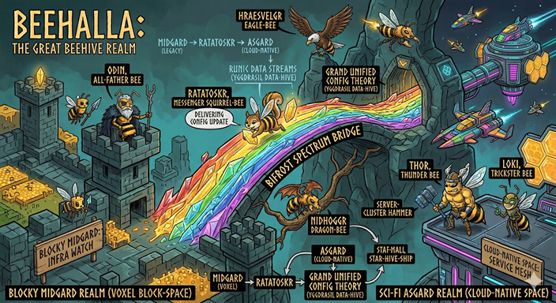

In February I wrote about [carefully integrating AI into open source](/oss-communities-and-ai/). In March I [shared Guardian Driven Development (GDD)](/guardian-driven-development/) — a methodology for making that real. Now putting it to use properly :-)

I made a soft link between Terasology and Destination Sol - two otherwise independent games. Coincidentally released on April 1st, but it is very real!

## Video

<!-- TODO: Replace with real link -->


That's [Terasology](https://terasology.org/) — an open-source voxel game with over a decade of community history — triggering chat in real time with [Destination Sol](https://destinationsol.org/), a 2D space shooter that has never had multiplayer. Two completely different engines (sharing some libraries, but that's coincidental so far), two different worlds, connected through a shared [Nakama](https://heroiclabs.com/nakama/) server running on a homelab Kubernetes cluster.

Players could chat across games. Items could be "beamed" between universes. A spaceship engine from Destination Sol currently shows up as a symbolic item in Terasology's inventory - but with a vehicle module wired up it could _work_. A block of stone got sent the other direction and turned into DS credits as if it was mined ore.

This is [Bifrost](https://github.com/SiliconSaga/bifrost) — a cross-game federation protocol — and this is its first contact.

## How

The "ridiculously ambitious idea" I teased back in February was Bifrost: a protocol for connecting game worlds, inspired by the mythical rainbow bridge between realms in Norse Mythology. It had been [sitting on a shelf for years](/4th-day-of-Xmas) because — honestly — it was too much work for a hobby project running on volunteer time.

What changed? The rise of the AI era and [GDD](https://siliconsaga.github.io/yggdrasil/gdd/).

The entire Bifrost implementation — Nakama deployment, engine subsystems in both games, integration tests, config systems, chat UI, item linking, the inventory "Beam In/Out" buttons — was built across four sessions. A couple sessions were 3-4 hours running 3 different projects via Claude on 3 different computers in parallel. One was an hour and a half with a toddler on my lap and one hand free. Another stretch happened during a family visit where I pulled out my phone occasionally (during quiet moments!) to review, approve, and guide Claude working on my home machine.

That's the thing about GDD that's hard to explain in documentation: it's not about the AI writing code for you. It's about entering a collaborative flow where your judgment steers and the agent executes, and the methodology keeps both of you in sync and tangents organized. The framework improved *itself* during this build — observations became skills, friction became automation, and the housekeeping got tuned through use.

## Okay but Technically

For the curious:

- **Nakama** (an open-source game server) deployed on a local k3d cluster via simple k8s manifests. PostgreSQL for persistence, NodePort services for access.

- **Terasology** got a new optional engine subsystem (`NakamaSubSystem`) following the existing DiscordRPC pattern. It connects via the Nakama Java SDK, bridges Gestalt chat events to a shared Nakama channel, and uses the engine's AutoConfig system for persistent settings. Console commands (`/link`, `/viewitem`, `/materialize`) handle the item linking protocol.

- **Destination Sol** got a `NakamaClient` wired into the game loop, a `/say` console command for chat, and — the fun part — **Beam Out** and **Beam In** buttons added directly to the inventory screen. Select an item, click Beam Out, and its metadata flies across the Bifrost to whoever's listening.

- **The protocol** is straightforward JSON over Nakama's chat channels: `{game, player, text}` for chat, `{game, player, type: "item_link", name, description, price}` for item links. Both games parse the same format and render appropriately — messages in Terasology's chat pane, banners with a dark background in DestSol's HUD.

- **Integration tests** run against the live Nakama server, proving auth, channel join, and message delivery at the SDK level before the games even launch.

We also upgraded protobuf across both games (3.x to 4.28.2), fixed a dual-port issue in the Nakama Java SDK (gRPC for API, WebSocket for realtime — a fun discovery), and sorted out Java 8 compatibility constraints in DestSol. Real engineering problems, solved collaboratively.

## The Bigger Picture

Bifrost isn't really about two games bridging chat. It's a proof of concept for something larger.

The [overlay architecture](https://siliconsaga.github.io/yggdrasil/getting-started/#how-adoption-works) we built into Yggdrasil means anyone can plug their own community's components into the same workspace. Your games, your services, your configuration — layered on top of a generic foundation. Bifrost is one overlay's answer to "what connects these worlds?" but the workspace pattern itself is game-agnostic.

What if a hundred contributors were working on variations of what Terasology could be — different mods, different servers, different visions? The traditional open source challenge is coordination: how do you avoid going in fifty different directions? The thing I'm starting to wonder is that maybe you *don't* avoid it. Maybe you embrace it. Make it easy to do your own thing, while there's a backbone that lets you interact with other "shards" of the game — and other games entirely.

The age of personalized software is arriving. AI means someone who never thought they could build something now can, even if it is just for their own use and enjoyment. Somewhere somebody is delighted that they made a goofy thing that made their day. Maybe they show a friend or two. I want more of that in the world.

GDD is my contribution to making that safer and more collaborative. Bifrost is the thing I hope makes it fun. And the workspace is designed so that you can bring your own projects, your own community, your own ambitions — and the tools just work.

## What's Next

First Contact is Phase 1. The [Bifrost design docs](https://github.com/SiliconSaga/bifrost/blob/main/bifrost-protocol.md) outline what comes after:

- **Phase 2: Presence and Ghosts** — see players from other games as ghost entities in your world
- **Phase 3: Cross-Server Travel** — portal between servers within the same game
- **Phase 4: Cross-Game Travel** — step through a portal from a voxel world into a spaceship cockpit, with content translation via the "Just Enough Porting" system

Each phase builds on the last, and each is designed to be built the same way we built this one: small teams, GDD-augmented, shipping real things in fragmented time.

Will it happen soon? Should it even be priority considering other needs in the Terasology world or wider world around it? I don't know. But I'm working to push overhead cost toward zero and optimize for how AI can help so that if somebody wills it, it can happen more easily.

## Try It

If you want to explore:

1. [Clone the Yggdrasil workspace](https://siliconsaga.github.io/yggdrasil/getting-started/)
2. Run `ws overlay init` for the tutorial overlay, or point it at the SiliconSaga community overlay
3. `ws clone --all` to pull the games
4. Start Claude Code, say hello, ask for Mentoring mode
5. Pick something that interests you and see what happens

The [issues are open](https://github.com/SiliconSaga/yggdrasil/issues). The methodology is self-improving. The community includes you.

And if nothing else — watch the video again. Two independent games, suddenly linked. Bridged in spare hours by one person and an agent, with a toddler occasionally mashing the keyboard. If that's possible, what else might be?

