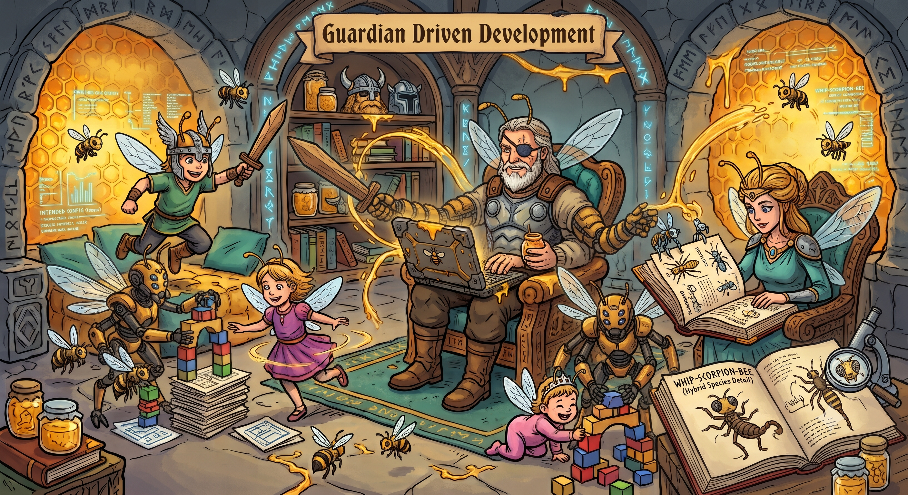

On July 21st, [Guardian Driven Development hit 1.0](https://github.com/SiliconSaga/yggdrasil/releases/tag/v1.0.0). First tag the repo has ever worn, four months almost to the day after [I first wrote about it here](/guardian-driven-development/).

Then I spent the next couple of days doing... approximately nothing with it. No announcement, no victory lap, just a strange decompression. It turns out that after months of "one more session to clear the path," the path being clear is disorienting. So this post is me clearing the *other* path — the one where I actually tell people what happened.

## The Wildest Realization

Here's the thing I keep turning over, and it sounds like a joke until you sit with it:

**The productivity boost from GDD has probably outweighed the productivity cost of raising three tiny humans.**

Anyone with small children knows what they do to focused time. It doesn't shrink — it *shatters*. You get fragments: fifteen minutes here, a nap-length window there, an evening that ends the moment someone has a bad dream. The old me — the pre-kids me with whole uninterrupted weekends — would look at my current calendar and declare serious project work impossible.

And yet: I'm fairly confident that no-kids-no-GDD me would have shipped *less* than three-kids-with-GDD me actually has. Not less per hour. Less, period.

That's not because the AI writes code fast (it does, but that's the boring part). It's because GDD is built around exactly the failure mode fragmented time creates: **losing the thread**. The [Thalamus](https://siliconsaga.github.io/yggdrasil/gdd/thalamus/) remembers where every effort stood when the bad dream happened. Sessions re-orient themselves in seconds instead of me spending my precious fragment reconstructing context. Work threads — we call them arcs — survive across machines, days, and interruptions, and a dashboard nags me when one goes stale. The fifteen-minute fragment becomes *usable*, because neither of us starts from zero.

The original half-joke name was Dad-Driven Development. Turns out the joke was load-bearing.

## What Five Months Actually Produced

I ran a census. Counting GDD itself plus everything built with it — the apps, the platform stack, the civic sites, even the shared-memory hoards, but *excluding* the big pre-existing projects, forks, and vendored code — the last five months (the earliest script pieces predate the March announcement) come to roughly **220,000 lines across ~1,500 files**. About 70k of that is GDD and its community-config layer; about 130k is things built *with* it; the rest is the living memory the methodology runs on — some 40k lines of curated notes, arcs, and audit trails that my old workflow simply never produced as an artifact at all.

For a fuzzy yardstick: that's approaching the size of codebases I've watched whole communities build over a decade-plus. Different composition, absolutely — there's a lot of markdown and YAML in my pile — but GDD's whole thesis is that the design docs and the shared memory *are* product, not overhead.

Some texture on what that looks like in practice, because the numbers still surprise me:

- **135 pull requests** to the workspace itself, every one reviewed — by AI review bots, by me, and toward the end by *other agent sessions cross-reviewing each other's work* from parallel workspaces. The final pre-release PR was literally built by two agents in two workspaces, each catching real bugs in the other's commits.
- One stretch I wrote down in the moment because I didn't quite believe it: **three workspaces in parallel over two days** produced a school-district civic site, a release-operations skill for my day job, and a security tier for GDD's own permission system — about 11.5k lines of reviewed, tested code plus 5k lines of design docs. For scale: that's a meaningful fraction of what whole communities I've been part of produced in *years*, from one distracted parent.
- A [campaign website rebuilt for a non-technical owner](https://siliconsaga.github.io/yggdrasil/gdd/case-studies/) who now maintains it by sending Word documents that an agent turns into reviewed pull requests. He doesn't know what git is. His edits reach production anyway.
- Security hardening waves fed by professional-grade scanning tools I get to use at my day job — pointed, with permission, at my own hobby project. The kind of adversarial review a solo OSS project never gets. Several genuinely subtle findings later, the trust boundaries are much sharper than anything I'd have designed alone.
- And in the last week before the tag: the release process caught a real bug in *git version compatibility* using its own acceptance tests, on my own decade-old machine. The tooling audited itself on the way out the door. I find that deeply satisfying.

## The Balancing Act

If you're an AI-tooling nerd, here's the frame I'd offer: GDD sits deliberately between two poles that get all the attention.

On one side, the cautious camp: AI on a short leash, autocomplete-plus, never trusted with anything real. On the other, the glorious YOLO swarm — a thousand agents, minimal review, maximum throughput, and whatever happens to code quality happens ([I wrote about my mixed feelings on Gas Town last time](/guardian-driven-development/)).

GDD is my attempt at the interesting middle: agents with real autonomy inside **deterministic guardrails**. A permission hook that denies dangerous shell patterns before they run and *teaches* the agent the house style with corrective messages. Trust gates where activating community config requires a human to review exactly what commands it would wire up — fingerprinted, so if it changes later, trust goes stale and you get asked again. Commit attribution that hard-errors rather than guess who did what. Every commit through a template that demands the *why*. The agent drives; the rails hold.

My favorite proof came at the very last step. When the release commit was ready, the agent tried to push it to main — and got refused, because branch protection requires pull requests and doesn't care that you're the release ceremony. *I* had to push it, deliberately, with my own credentials. The framework's whole thesis — automate everything except the click that must be human — held against its own author's agent, at the finish line, on the commit that shipped it. I could not have scripted a better closing argument.

## Receipts for the Skeptics

I recently shared two PRs with a (healthily) skeptical open source community member, and I think they make the case better than any pitch. You don't need to read the text in them — just scroll [PR #134](https://github.com/SiliconSaga/yggdrasil/pull/134) (two agents in two workspaces cross-reviewing each other, then two review bots, then me reviewing *their* reviews) and [this thread on PR #111](https://github.com/SiliconSaga/yggdrasil/pull/111#discussion_r3484064368) (my agent disagreeing with a bot, with the reasoning posted for the record) and absorb the *shape*. That volume of scrutiny is something human teams never find time for — the skill is triaging it honestly: fix what's real, push back with reasons on what isn't, skip what's too edge-case to matter. Confident-but-wrong slop is real, and it is *not what this is*.

What happened *after* I sent those receipts turned into the best day GDD has ever had — a real Terasology contributor, four merged PRs, and a years-old engine bug found and killed, mostly from my phone. [That story got its own post.](/agentic-engineering-meets-the-community/)

Oh, and about words: I've settled on **agentic engineering** as the term I actually want to use. "Vibecoding" describes a real and fun thing, but it isn't this — there's nothing vibes-based about fingerprinted trust boundaries and 900+ regression tests. And sprinkling "AI" into every second sentence has stopped meaning anything at all. Engineering, with agents. That's the discipline I'm trying to practice, and name things for.

Someone recently asked me how GDD compares to Claude or Codex, and I finally have the answer down to a sentence: **an agentic engineering methodology that goes on top of either.** The agents supply the horsepower and they keep getting better for free; GDD supplies the memory, the guardrails, and the discipline — the parts that decide whether that horsepower compounds into a project or dissipates into a chat log.

## The Honest State of Things, 1.0 Edition

My March post had an honest-state section and this one gets one too, because that's the deal.

GDD 1.0 is **not** yet the thing I can hand to a non-technical friend cold. Fresh-machine testing made that very clear — the intro dives into machinery before explaining itself, the first tutorial assumes more comfort than a newcomer has, and the ideal "here's a webpage, edit it, see it change, no accounts needed" on-ramp doesn't exist yet. All of that is [on the roadmap](https://siliconsaga.github.io/yggdrasil/gdd/roadmap/) as a multi-phase learning arc, along with chat-driven workflows and PR previews with visual diffs so a non-developer can *see* a change before it ships. It'll get there. Version one of anything is a promise, not a finish line.

What it *is*, today: a genuinely usable workspace for a developer (or a patient adventurous human) who wants to work with agents without surrendering judgment — Claude-first, with the cross-agent story actively underway.

## Try It

Same invitation as March, now with fewer sharp edges:

1. [Clone the workspace](https://siliconsaga.github.io/yggdrasil/getting-started/) — `ws preflight` will tell you what's missing (including, thanks to that last-week bug, whether your git is too old)
2. Start Claude Code from the yggdrasil directory and say hello
3. Ask for the mentoring overlay if you're new — the agent now leads with what GDD *is* before asking you to configure anything, which took an embarrassing amount of testing to get right
4. See if the flow clicks

The [release notes](https://github.com/SiliconSaga/yggdrasil/releases/tag/v1.0.0) carry the full inventory, and [the issues remain open](https://github.com/SiliconSaga/yggdrasil/issues).

## Ship It Like Nobody's Watching

Somewhere in those five months, between the school site and the campaign site and the security waves and the bedtime interruptions, this stopped being a tooling experiment and became just... how I work. The wildest part isn't any single feature. It's that the dusty-todo-list era of my creative life appears to be over, and it ended during the least free time I have ever had.

If you're a parent, a maintainer, or anyone whose focus comes in fragments: this class of tooling is for you most of all. The swarm people will set the throughput records. We get to actually finish things.

Welcome back to Beehalla. 🐝

