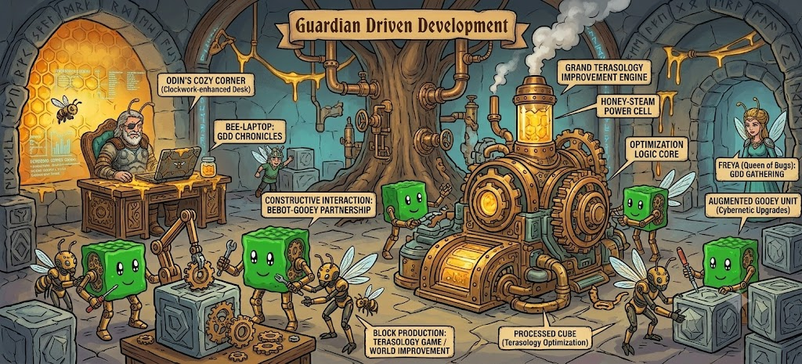

Days after [GDD hit 1.0](/agentic-engineering-and-tiny-humans/), it had the best day of its life. This is the story of that day — a skeptic, a contributor, four merged pull requests, and a years-old engine bug that finally ran out of luck. Most of it happened on my phone.

## The Skeptic

It started in the Terasology review channel with Lampe2020 — a community regular, and I want to be precise about what that means here. Every open-source community has people like Lampe: present for years, invested, exactly the kind of person a project depends on — who also has real concerns about AI. Not reflexive hostility; considered discomfort with how the technology is being sold and what it might displace. That's a large group, their concerns are entirely valid, and any "new way" of contributing that doesn't have an answer for them doesn't have an answer at all.

I'd shared a couple of PRs from the GDD workspace as examples of that new way, and Lampe gave them a fair scroll and landed roughly here:

> from the quick, superficial scroll-through I now just did it looks like it's sensible. And don't get me wrong, I sometimes use AI as well, but the thing I hate the most about AI is that tech CEOs try to frame it as this revolutionary thing that will replace human workforce, instead of admitting that it's just a tool. And a tool can't work on its own, it needs to be used by a human.

"It looks sensible, *and*" — that's the honest position, and I agree with every word after the "and" too. It *is* a tool. It *does* need a human. The entire point of Guardian Driven Development is engineering that relationship instead of hand-waving it — which is why my answer wasn't an argument but receipts. Two PRs, with the instruction to not bother reading the text: just scroll and absorb the shape. Commits attributed to me-plus-Claude or me-plus-Codex. Bot reviews triaged honestly — real findings fixed, wrong findings pushed back on with reasons posted for the record, the too-niche tail deliberately skipped. Review volume no human team ever finds time for, because in OSS we've watched PRs sit unreviewed for months and years.

Then the same day handed me a much better receipt than anything I could link.

## The Contributor

While that conversation was still warm, soloturn — a longtime Terasology contributor — asked me to look at [a fix for a world-generation crash](https://github.com/Terasology/CoreWorlds/pull/48), and followed it with [a second PR](https://github.com/MovingBlocks/Terasology/pull/5330) about saved games failing to load. An utterly ordinary open-source moment, and normally where things stall: reviewing those properly means the right repos at the right revisions, building a big Java project, running the game, and holding a facet-border dependency graph in your head. A focused-evening task. I had a toddler on my lap.

So I pasted the links to my agent and drove the review the way GDD is built to be driven: in fragments, half from my phone, between lunch-making and birthday-week chaos. What came out of that afternoon:

- The workspace pulled in the contributor's branches and grew from 13 modules to 55 — dependency resolution and remote wiring that used to be its own little evening of toil, done from a couple of pasted links.
- We couldn't reproduce the crash with a known seed, so the agent built a **headless game harness** to boot the actual engine with the right modules and validate real launches. I never suggested that; I only said reproduction was hard.
- Under soloturn's correct module-level fix, the review found an **engine-level root cause**: a method whose implementation violated its own Javadoc, with the symptoms randomized by hash ordering that changes between JVM runs. There was even a unit test faithfully enshrining the bug as intended behavior — it had to be inverted, not obeyed.
- A deterministic regression test was built where reproduction was "impossible," verified by falsification: it fails with the fix reverted, passes with it.
- When the agent went to push, it was **refused** — I deliberately never gave it push access to the Terasology orgs. So it did the polite thing instead: pushed to its own fork and opened PRs *into soloturn's branches*, handing him the additions rather than rewriting his work under him. [One](https://github.com/Terasology/CoreWorlds/pull/49), [two](https://github.com/MovingBlocks/Terasology/pull/5331).
- One bot finding was judged real-but-out-of-scope, so instead of silently dropping it, it became [a properly attributed issue](https://github.com/MovingBlocks/Terasology/issues/5332) for later.

All four PRs merged the same day. A bug class that has caused this fifteen-year-old project grief for years — the "random" world-gen crash that never reproduced when you looked at it — now has a name, a test, and a fix. And soloturn, bless him, went from "impressed" to reading the GDD docs to asking how to set it up before the day was over.

The full technical write-up, including the annotated Discord thread and every wrong turn, is now [an official GDD case study](https://siliconsaga.github.io/yggdrasil/gdd/case-studies/terasology-contributor-review/). Thank you, soloturn — for the fixes, and for being the first outside contributor to meet GDD in the wild.

## What This Means for Communities

The skeptic's frame and the contributor's day are the same story told from two ends. Yes: it's just a tool, and it can't work on its own. But look at what the *human-plus-tool* unit did to the oldest problem in open source — the review bottleneck. The limiting resource in OSS has never been code; it's qualified attention. Maintainers burn out not from writing software but from the unreviewed queue silently accusing them every time they log in.

What changed that day is that a maintainer's fifteen spare minutes became enough to give a contributor's work the deep review it deserved — deeper, honestly, than most focused evenings would have produced, because the agent could afford to build a headless harness and chase the root cause two layers down while I made lunch. The contributor got same-day engagement instead of a months-long wait. The project got a regression test for a bug it didn't know it had. Nobody's judgment was outsourced: every finding was triaged, the bot comment we disagreed with got a reasoned reply, and the one thing that needed a human — push access to the org — stayed human by design and held when a rushed maintainer on a phone said "go ahead" anyway.

That's what I mean by agentic engineering rather than vibecoding. The vibes were great, don't get me wrong. But the reason this worked wasn't vibes — it was fingerprinted trust boundaries, commit attribution that names who did what, and a review discipline that treats bot findings as claims to verify rather than commands to obey. If you're wondering where GDD sits relative to the Claude or Codex you may already use: it's an agentic engineering methodology that goes on top of either. The agent brings the horsepower; GDD brings the discipline that makes it compound.

## The Week After

That day turned out to be the start of something with momentum, and the week that followed gave me three more data points worth reporting honestly.

**The feedback loop closed fast.** soloturn's first real critique after using the workflow himself was that the generated PRs and commits run *wordy* — he even lobbed a "caveman mode" plugin at me, only half joking. He was right; I'd been slow-boiled into not noticing. Within a day that feedback became explicit prose budgets in the workspace templates and a `changeNotes` preference knob in the config — terse, standard, or detailed, settable per community or per person — and his community's config now defaults to terse. First-user complaint to shipped, configurable fix in about a day is the kind of loop that makes a methodology feel alive.

**The pampering is real.** Midweek I told my agent I wanted to review a module PR, and it prevalidated the branch, reviewed the code, checked it out, wired up a test configuration, and launched the game for me — having gone the extra mile of pre-binding the module's hotkey in the game settings. It watched the logs and commented live while I played the test scenario, then went back to work when I closed the game. I started that session from my phone and the game launched on a spare laptop behind me. PR review and its logistics used to be a moderate headache — which is partly why it always fell behind, for me and for every maintainer I know. Setup that took 30 minutes of spare-time willpower now takes 30 seconds, and the human attention goes entirely to the part that actually needs judgment.

**And the honest lament.** Another longtime contributor — someone with serious architecture skills — put the uncomfortable side into words: they can't keep up with the rate at which agents now produce genuinely valid code, waving it through feels wrong, and that makes them — the human reviewer — the bottleneck. They're right too, and I don't think the answer is reviewing less. The answer I gave them is the whole thesis of this post: augment the reviewer. The tribal knowledge, the architecture sense, the nose for "that's not quite right" — GDD doesn't replace any of that; it deletes the toil around it so those skills get applied in minutes instead of stolen evenings. My own knowledge still catches agent mistakes, faster than ever, because the agent pre-explains the change and I get to react with "oh yeah, I remember that" instead of excavating from scratch.

The part I don't have an answer for yet: if the toil that used to train junior developers is evaporating, how do we grow the next generation of people with that architecture sense at all? Programs like GSoC feel more valuable than ever — but only if we stay close enough to the students to know they're learning rather than just approving. That one deserves its own post, and probably its own decade.

## An Invitation

If you maintain something — especially something old, loved, and under-reviewed — this is the use case I'd point you at first. Not "let AI write your project," but *give your spare fragments of attention a lever*. The setup is [a clone and a preflight check away](https://siliconsaga.github.io/yggdrasil/getting-started/), and the [case study](https://siliconsaga.github.io/yggdrasil/gdd/case-studies/terasology-contributor-review/) shows exactly what a first real session can look like, warts and all.

And if you're where Lampe is — a would-be or long-time contributor with entirely reasonable concerns about all this: stay skeptical. The discipline only works because someone keeps asking whether the tool is being used or merely trusted, and communities need that voice more than they need another PR. Just know that the receipts are getting easier and easier to produce, and you're allowed to demand them.

🐝
